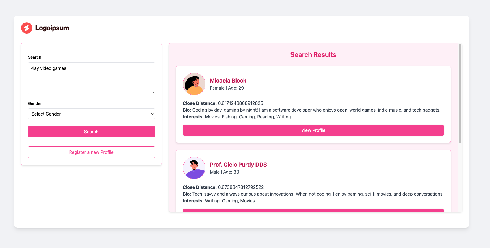

# Date Search in Laravel with Vectorized Database

## Overview
This repository demonstrates the implementation of date-based search using a vectorized database in Laravel. The project leverages PostgreSQL with vector embeddings for efficient similarity-based searches.



## Installation

### Start Docker Containers
To start the required services, run:
```sh
docker compose up -d
```

### Database Migration
Run the following command to migrate the database schema:
```sh
docker compose exec app php artisan migrate
```

### Generate Embeddings
To generate embeddings for user bios and interests, execute:
```sh
docker compose exec app php artisan app:generate-embedding
```

## Application Access
The Laravel application is accessible at:
```
http://localhost:9900
```

## Database Administration
To inspect embedding data using pgAdmin, access:
```
http://localhost:5050
```

### PG Admin Credentials
```env
PGADMIN_DEFAULT_EMAIL: admin@admin.com
PGADMIN_DEFAULT_PASSWORD: admin
```

### PostgreSQL Database Credentials
```env
POSTGRES_DB: laravel
POSTGRES_USER: postgres
POSTGRES_PASSWORD: password
```

## Technical Details
This project serves as a starting point for integrating vectorized search capabilities within a Laravel application.

### Embedding Model
The project utilizes the following model for generating embeddings:
```python
SentenceTransformer("all-MiniLM-L6-v2")
```

### Search Methodology
The search functionality is based on distance-based similarity matching:
- Lower similarity scores indicate better matches.
- Users with the smallest distance values are prioritized in search results.

## Embedding Service (Python Container)
```yaml
embedding:
  container_name: vl_embedding
  build:
    context: ./docker/python
  restart: unless-stopped
  ports:
    - "5001:5001"  # Expose the embedding service API
```

## Author
**Gurinderpal**  
[GitHub](https://github.com/Gurinder-Batth)  
[LinkedIn](https://www.linkedin.com/in/gurinderpal-batth/)